# Kindle 너무 좋은데, 한글책도 넣고 싶다.

킨들로 주로 amazon이나 manning 책을 보는데 국내 서적도 넣고 읽고 싶을때가 많다. 방법을 찾던 중 Adobe Digital과 Calibre를 사용하여 Kindle Mobi 파일을 만들 수 있는 방법을 찾았다. 이를 정리해보았다.

## Step1. 책을 산다.

제일 중요한 건데. 책을 삽니다. 불법 복제는 금물입니다. 구글 PlayStore에서 국내 도서를 구입할 수 있습니다. 이때 주의할 점은 e-book reader로 다운 받을 수 있는 책만 가능하다는 것입니다.

## Step2. 책을 다운로드 받는다.

파일 형식은 epub로 합니다.

<figure class="half">
  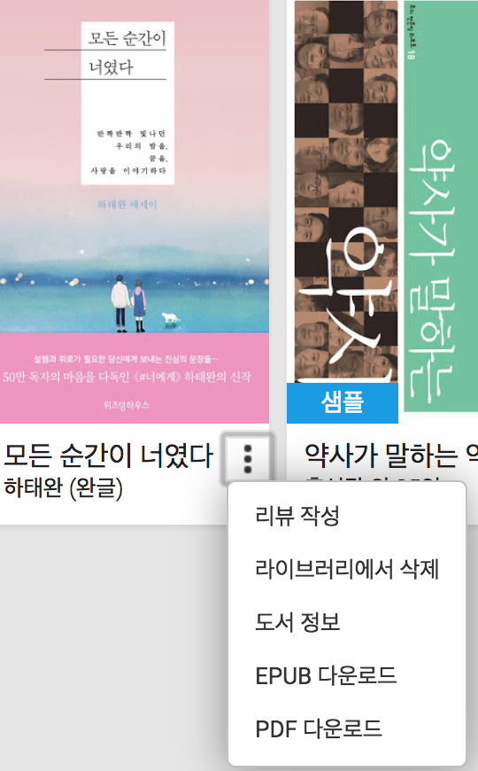
  <figcaption>구글 고객센터 설명</figcaption>
</figure>

## Step3. Adobe Digital Editions 이용

다음의 고객센터 설명처럼 프로그램을 다운받아 Step2에서 다운받은 파일을 넣습니다.

<figure>
  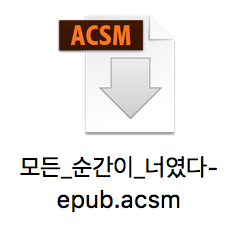
  <figcaption>다운받은 파일</figcaption>
</figure>

[구글 Play e-Reader로 책 읽기](https://support.google.com/googleplay/answer/179863?topic=1187416&ctx=topic&visit_id=1-636587838517312440-4241588597&rd=1)

<figure class="half">
  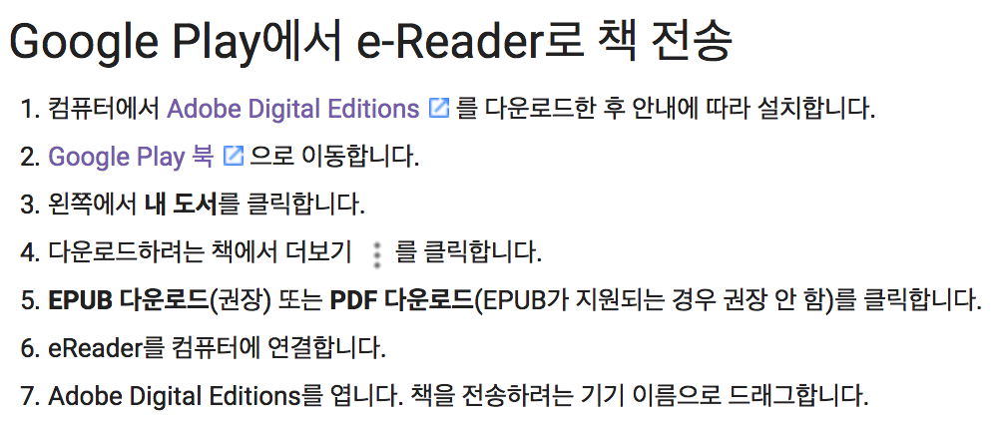
  <figcaption>구글 고객센터 설명</figcaption>
</figure>

## Step4. epub 파일 찾기
책을 선택해서 파일로 이동해보면 다음과 같이 epub 파일이 생성된 것을 알 수 있습니다.

<figure class="half">
  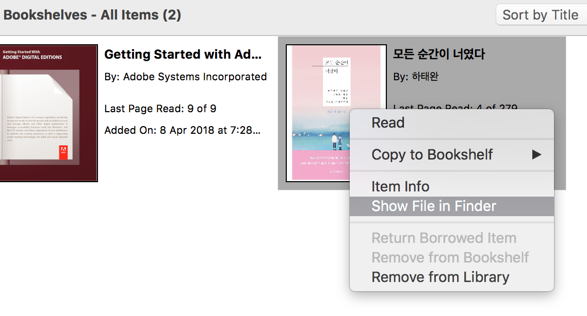
  <figcaption>파일 찾기</figcaption>
</figure>

<figure class="half">
  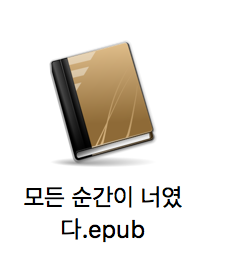
  <figcaption>epub 파일 생성</figcaption>
</figure>

##  Step5. Calibre 및 DeDRM 플러그인 설치

[Calibre 다운로드](https://calibre-ebook.com/download_osx)
[Calibre DeDRM 플러그인 다운로드](https://github.com/apprenticeharper/DeDRM_tools/releases/tag/v6.3.6a)

여기서 주의할 점은 다운받은 zip 파일을 압축 해제한 후 DeDRM_tools_6.3.6a/DeDRM_calibre_plugin/DeDRM_plugin.zip 파일을 찾아야 한다는 것입니다.

## Step6. Calibre 환경설정

다음과 같이 환경설정>플러그인을 선택한 후 "파일에서 불러오기"를 이용하여 앞서 다운받은 DeDRM_plugin.zip파일을 설치합니다.

<figure class="half">
  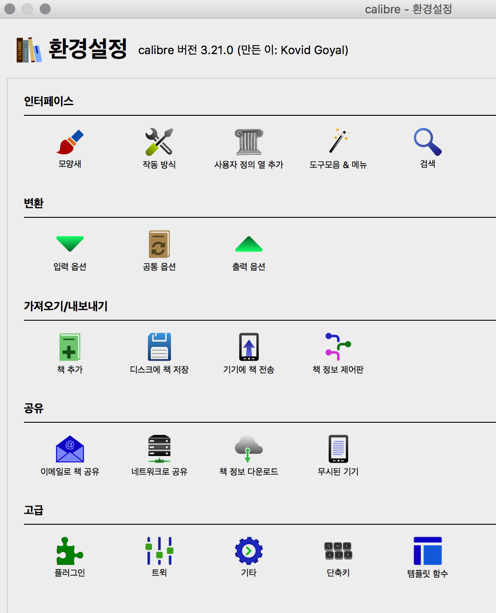
  <figcaption>Calibre 환경설정</figcaption>
</figure>

설치가 완료되면 다음과 같이 DeDRM 목록을 볼 수 있습니다.

<figure class="half">
  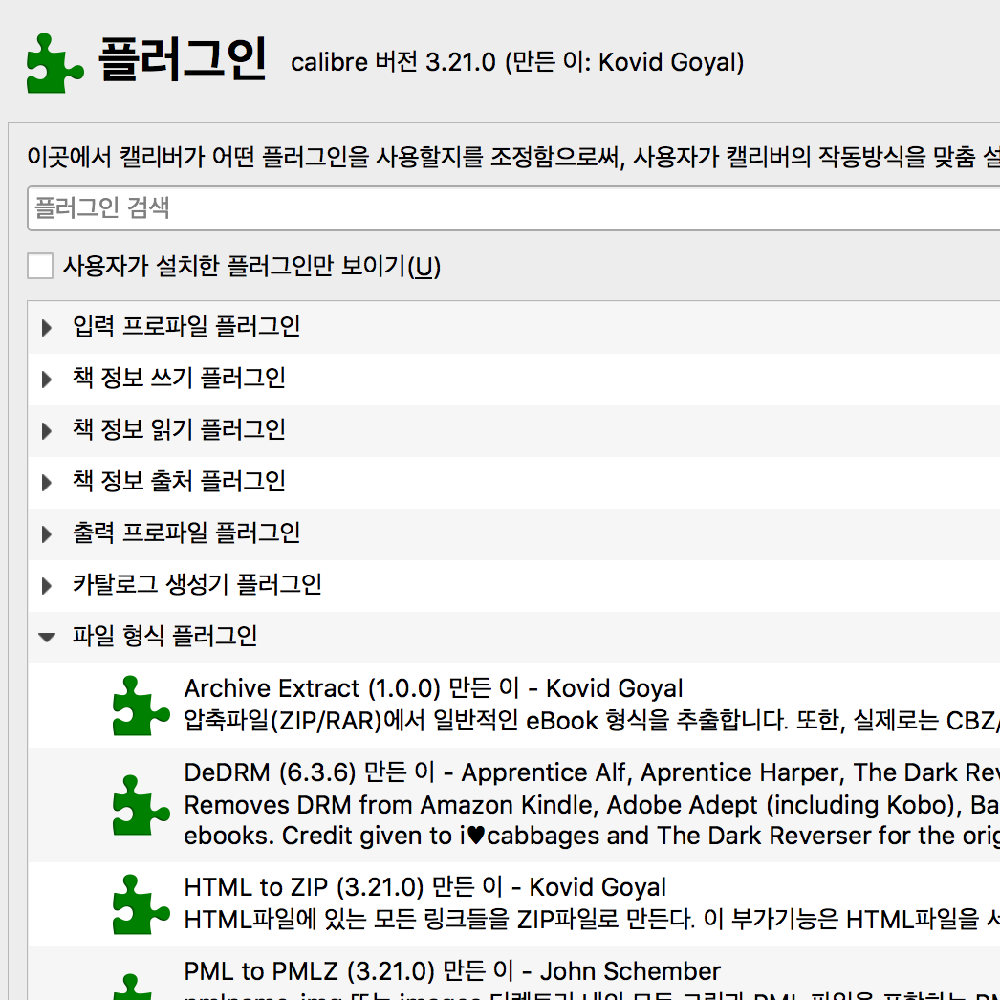
  <figcaption>DeDRM 플러그인</figcaption>
</figure>

마지막으로 Calibre를 재시작합니다.

## Step7. epub를 열고, 변환

프로그램을 시작하여 epub 파일을 프로그램으로 열면 다음과 같이 책이 올라가 있는 것을 볼 수 있습니다. Kindle을 연결하고 "기기로 전송"을 하면 킨들에서 책을 볼 수 있습니다.

<figure class="half">
  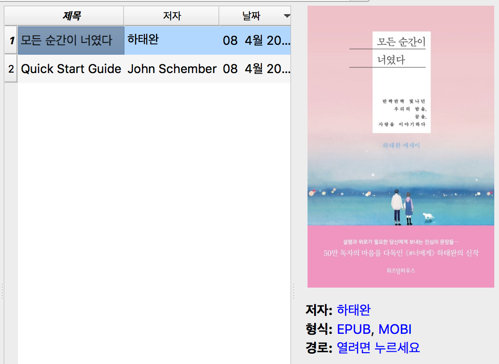
  <figcaption>e-book</figcaption>
</figure>

<figure class="half">
  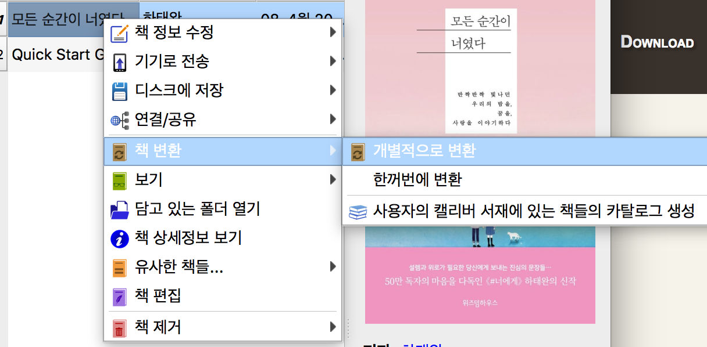
  <figcaption>우클릭으로 변환하기를 선택</figcaption>
</figure>

<figure class="half">
  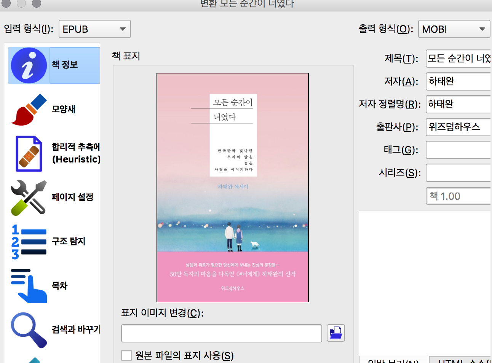
  <figcaption>mobi로 선택</figcaption>
</figure>

<figure class="half">
  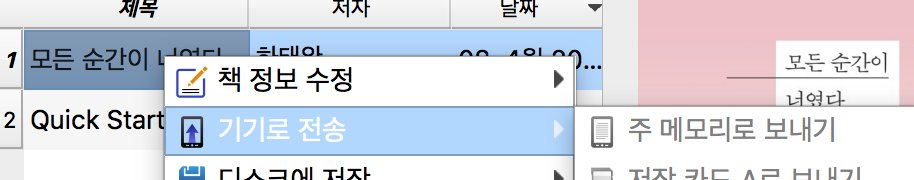
  <figcaption>킨들로 전송</figcaption>
</figure>

이상으로 한글책을 킨들에 넣어서 보는 방법이었습니다. 다들 즐독하세요.